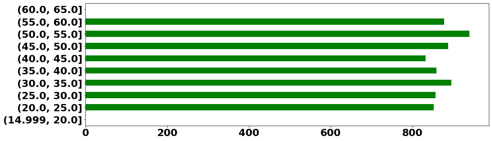
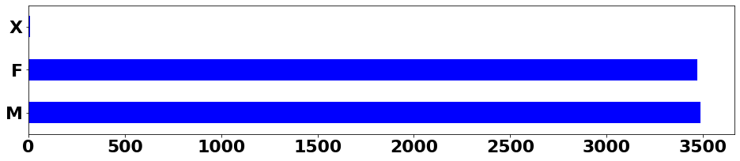
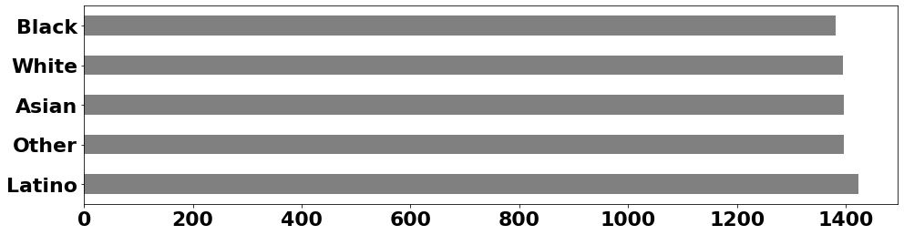
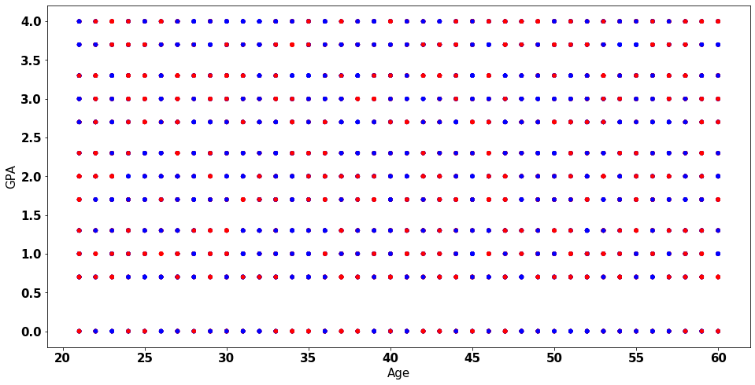
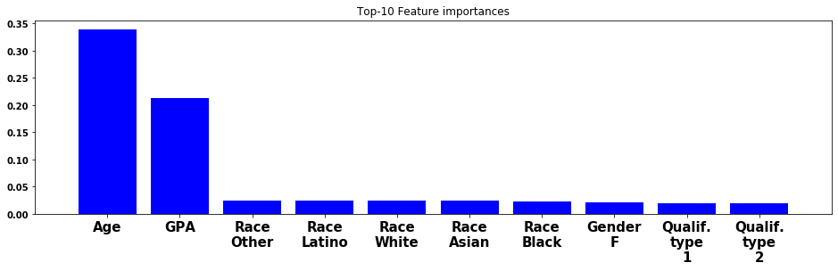
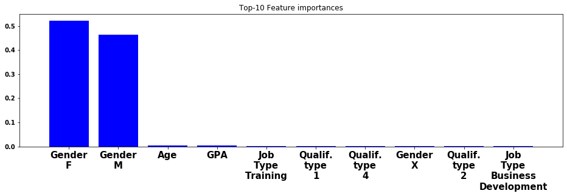
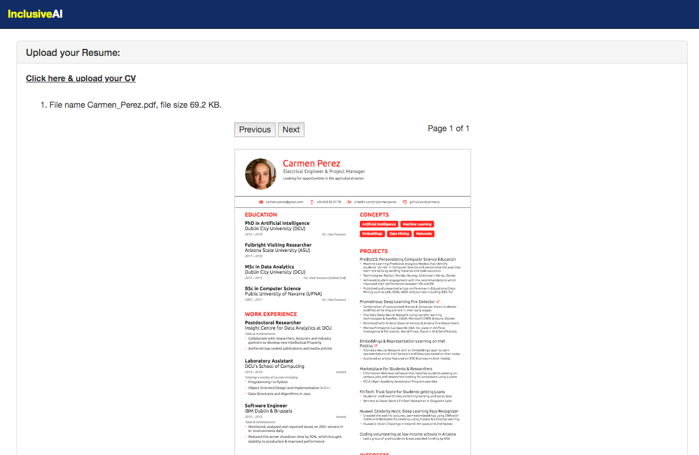
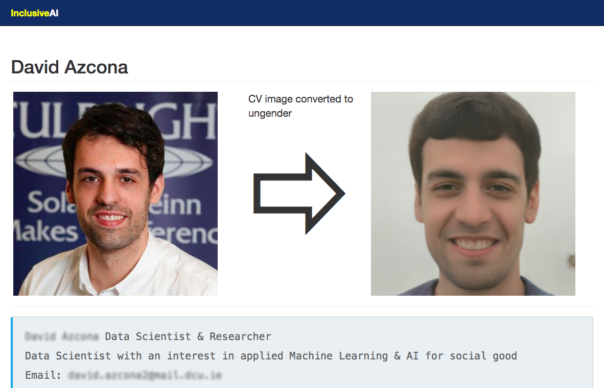

# InclusiveAI at AI NI Datathon for SmashFly's Challenge

We developed a Machine Learning pipeline to analise data bias in recruiting and developed Computer Vision technology to remove human & machine inherent biases in recruiting and pre-screening processes.

* Slides: [InclusiveAI at AI NI Datathon 2019](https://docs.google.com/presentation/d/1Cjfwu2QKFUeXTh0Mbq8HHv01mY-ZgrU4EgKFXyouQo8/edit?usp=sharing)
* [Youtube Video](https://www.youtube.com/watch?v=4P6Sl52UrGU)

## Motivation

## Notebooks

1. [Exploratory Data Analysis](src/notebooks/1.%20EDA.ipynb): EDA by looking at all the fields and their values
2. Data Wrangling: Data Clearning & Conversion 
3. Data Summarization:
   * [Correlations & Scatter plots](src/notebooks/3.%20Correlations%20%26%20Scatter%20plots.ipynb)
   * Data Distributions
4. [Feature Engineering](src/notebooks/4.%20Features.ipynb): handcraft a bunch of features from the fields
5. Feature Selection & Dimensionality Reduction: PCA, tSNE, UMAP
6. [Split the data](src/notebooks/6.%20Split%20Train%20and%20Val%20sets.ipynb): split the dataset into Train and Validation sets
7. [Modelling a classification model](src/notebooks/7.%20Modelling.ipynb):
   * Model a Random Forest classifier and analyse the power of their features
8. Ablation studies: fitting a Linear Regression model and running ablation studies to measure the variance explained by the features
9. Mutual Information Exploration: measuring the mutual information (mutual dependence between two variables) of each of the features we figured as important (based on the ablation study) and the precision mark.
10. Hyper-parameter tuning: tune the model
11. Train the final model: train the final model and build the submission file

You can always view a notebook using https://nbviewer.jupyter.org/

## Technologies

* [Python 3](https://www.python.org/)
* [Docker](https://www.docker.com/)
* [numpy](http://www.numpy.org)
* [pandas](https://pandas.pydata.org/)
* [matplotlib](https://matplotlib.org/)
* [scikit-learn](https://scikit-learn.org/)
* [pillow](https://pillow.readthedocs.io/)
* [jupyter](https://jupyter.org/)
* [Flask](http://flask.palletsprojects.com)
* [Bootstrap](https://getbootstrap.com/)
* [PyPDF2](https://github.com/sylvainpelissier/PyPDF2) & upgrade to the latest ```pip install --upgrade https://github.com/sylvainpelissier/PyPDF2/archive/master.zip```
* [Nvidia’s StyleGAN](https://github.com/NVlabs/stylegan)

## Figures

**EDA**: Exploring the Age:


**EDA**: Exploring the Gender:


**EDA**: Exploring the Race:


**Scatter**: Age vs GPA:


**Random Forest**: Forest Importances:


**Random Forest**: Forest Importances with Data Bias:


**Our solution: Inclusive AI**: Upload your CV:


**Our solution: Inclusive AI**: CV scrubbed:


## Learning Resources

* The Bigot in the Machine: Data Bias by Prof Alan Smeaton: https://www.insuranceireland.eu/media/Insurance-Ireland-Alan%20Smeaton%20PDF.pdf
* https://www.irishtimes.com/business/technology/the-bigot-in-the-machine-tackling-big-data-s-inherent-biases-1.3094978
* https://stevenloria.com/hosting-static-flask-sites-on-github-pages/

## Challenges

* Extracting images and text from PDFs: https://stackoverflow.com/questions/2693820/extract-images-from-pdf-without-resampling-in-python